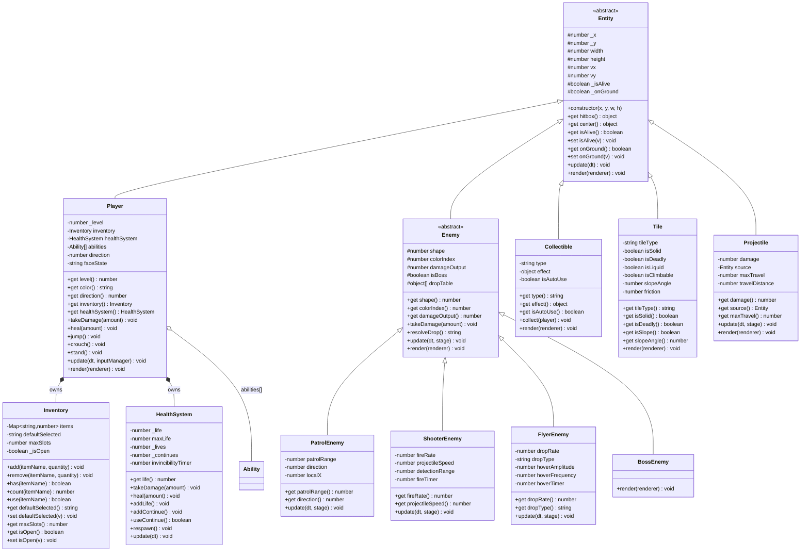

# Class Architecture

## Overview

This document formalizes the entire OOP class hierarchy for the Super Fruit World project. Every class across both engine (`src/engine/`) and game (`src/game/`) layers is defined with its inheritance, method signatures, constructor DI contracts, and composition relationships. Mermaid `classDiagram` syntax provides the visual inheritance tree.

The architecture follows a strict three-layer separation per R1.2:
- **Engine layer** — Generic HTML5 game engine. No game awareness.
- **Platformer layer** — Generic platformer engine. No fruit/color/name awareness.
- **Identity layer** — All Super Fruit World specifics in `data/` JSON only.

---

## Engine Layer Classes

### Core / Lifecycle

#### `GameLoop`

Manages the requestAnimationFrame loop with variable timestep, catch-up, and decoupled render. Owns the timing and orchestration contract. Stops on `Scene.exit()` and restarts on `Scene.enter()`.

```
constructor(targetFPS: number, sceneManager: SceneManager)
start(): void
stop(): void
pause(): void
resume(): void
get isRunning(): boolean
get isPaused(): boolean
```

**Composition:** owns `SceneManager` (injected).

---

#### `SceneManager`

Manages a registry of named scenes and handles transitions between them. Only one scene is active at a time.

```
constructor()
registerScene(name: string, scene: Scene): void
unregisterScene(name: string): void
switchTo(name: string): void
get currentScene(): Scene | null
get sceneNames(): string[]
```

**Composition:** owns a `Map<string, Scene>` registry.

---

#### `Scene`

Abstract base class for all game scenes (title screen, world map, stage gameplay, etc.). Subclasses implement `enter()`, `exit()`, `update()`, and `render()`.

```
constructor(name: string)
get name(): string
enter(previousScene: Scene | null): void
exit(nextScene: Scene | null): void
update(dt: number, inputManager: Engine.InputManager): void   // abstract
render(renderer: Engine.Renderer): void                         // abstract
```

**Composition:** receives `InputManager` and `Renderer` via method parameters (not constructor — scene composition root wires these at call time).

---

### Rendering

#### `Renderer`

Wraps the Canvas 2D API. All drawing methods use visual units — the renderer handles scaling to canvas pixels internally. Provides rounded-corner geometry primitives per R3.1 and R3.2.

```
constructor(canvasSelector: string, scaleConfig: {unitHeight: number})
get canvas(): HTMLCanvasElement
get context(): CanvasRenderingContext2D
get unitScale(): number               // pixels per visual unit
get viewportWidth(): number           // canvas width in visual units
get viewportHeight(): number          // canvas height in visual units
clear(): void
setCameraTransform(camera: Camera): void
drawCircle(cx: number, cy: number, radius: number, fillColor: string, borderColor: string | null, borderWidth: number): void
drawRect(x: number, y: number, width: number, height: number, cornerRadius: number, fillColor: string, borderColor: string | null, borderWidth: number): void
drawPolygon(cx: number, cy: number, radius: number, sides: number, rotation: number, cornerRadius: number, fillColor: string, borderColor: string | null, borderWidth: number): void
drawText(text: string, x: number, y: number, font: string, color: string, align: string): void
drawLine(x1: number, y1: number, x2: number, y2: number, color: string, width: number): void
```

---

#### `Camera`

Manages the viewport transform (panning/scrolling). Converts between world coordinates and screen coordinates. All rendering goes through the camera transform.

```
constructor()
get x(): number
set x(v: number): void
get y(): number
set y(v: number): void
get width(): number                       // viewport width in visual units (set by renderer)
get height(): number                      // viewport height in visual units (set by renderer)
setSize(w: number, h: number): void
worldToScreen(worldX: number, worldY: number): {x: number, y: number}
screenToWorld(screenX: number, screenY: number): {x: number, y: number}
follow(target: {x: number, y: number}, smoothing: number): void
isVisible(worldRect: {x: number, y: number, width: number, height: number}): boolean
constrainToBounds(bounds: {x: number, y: number, width: number, height: number}): void
```

---

### Input

#### `InputManager`

Unified input abstraction supporting both keyboard and gamepad. Game logic queries named actions (e.g., `"jump"`, `"dash"`) — never raw key codes or button indices. Bindings are loaded from `data/input/bindings.json`.

```
constructor(bindingsConfig: object)
update(): void                                    // must call each frame before queries
isDown(action: string): boolean
isPressed(action: string): boolean                 // true on the frame it first goes down
isReleased(action: string): boolean                // true on the frame it first goes up
getAxis(action: string): number                    // -1.0 to 1.0 for analog inputs
isComboHeld(actions: string[], holdTime: number): boolean  // all held simultaneously for N seconds
get deadZone(): number
reloadBindings(bindingsConfig: object): void       // reconfigure at runtime
```

---

### Physics

#### `PhysicsEngine`

Applies forces (gravity, friction) and integrates velocity/position. Does NOT handle collision — collision is delegated to `CollisionSolver`. Generic — no platformer-specific assumptions.

```
constructor(config: {gravity: number, maxFallSpeed: number, friction: number})
get gravity(): number
set gravity(v: number): void
get maxFallSpeed(): number
get friction(): number
applyGravity(entity: Entity, dt: number): void
applyFriction(entity: Entity, dt: number): void
integratePosition(entity: Entity, dt: number): void
getAppliedForce(entity: Entity): {x: number, y: number}   // net force for this frame
```

---

#### `CollisionSolver`

Pure math — no state. Performs AABB collision detection and resolution. Slope collision is handled separately by the `SlopeResolver` utility.

```
constructor()
checkAABB(a: {x: number, y: number, width: number, height: number}, b: {x: number, y: number, width: number, height: number}): boolean
getOverlap(a: {x: number, y: number, width: number, height: number}, b: {x: number, y: number, width: number, height: number}): {x: number, y: number} | null
resolveCollision(movable: {position: {x: number, y: number}, velocity: {x: number, y: number}, hitbox: object}, solid: {x: number, y: number, width: number, height: number}): object  // returns corrected position+velocity
getNormal(movable: object, solid: object): {x: number, y: number}
```

---

### Audio

#### `AudioEngine`

Manages all audio output — synthesized SFX/BGM via Web Audio API and optional pre-recorded `.ogg` playback. Consumes named resources; resolves source type at runtime. Uses `NoteFrequencyCalculator` for note-name → Hz conversion.

```
constructor(audioConfig: object, sfxConfig: object, bgmConfig: object, noteCalculator: NoteFrequencyCalculator)
get masterVolume(): number
set masterVolume(v: number): void
get bgmVolume(): number
set bgmVolume(v: number): void
get sfxVolume(): number
set sfxVolume(v: number): void
get isAudioEnabled(): boolean
playSFX(name: string): void
playBGM(name: string, crossfade?: number): void
stopBGM(): void
pauseBGM(): void
resumeBGM(): void
get currentBGM(): string | null
preload(name: string): Promise<void>     // preloads an .ogg file
```

**Composition:** owns `NoteFrequencyCalculator` (injected). Owns Web Audio API `AudioContext` (created internally).

---

#### `NoteFrequencyCalculator`

Converts named musical notes to Hz using equal temperament. Fully designed in [`note-frequency-calculator.md`](note-frequency-calculator.md). Wired into `AudioEngine` constructor.

```
constructor(tuningConfig: {reference-note: string, reference-frequency: number, note-range: {lowest: string, highest: string}})
get referenceFrequency(): number
get referenceNote(): string
get referenceMidi(): number
get lowestNote(): string
get highestNote(): string
get lowestMidi(): number
get highestMidi(): number
parseNote(noteName: string): {letter: string, accidentalStr: string, octave: number, semitoneBase: number, accidentalOffset: number}
midiNumber(noteName: string): number
frequency(noteName: string): number
validate(noteName: string): true
isInRange(noteName: string): boolean
generateDictionary(): Map<string, number>
```

---

### Data

#### `DataLoader`

Loads all JSON data files eagerly at boot. Validates keys against `^[a-z0-9-]+$` (R5.2 enforcement). Provides typed access to loaded data. Configurable base path for the `data/` directory.

```
constructor(basePath: string)
loadAll(fileList: string[]): Promise<void>         // eager load, aborts on any error
loadFile(path: string): Promise<object>             // load a single JSON file
get(path: string): object                           // retrieve loaded data by path (e.g., "colors.json")
getAll(): Map<string, object>                       // all loaded data
validateKeys(obj: object, path: string): void       // R5.2 enforcement — throws on violation
```

---

#### `LocaleManager`

Internationalization — retrieves user-facing strings by key. Falls back to `en-us` for missing keys in other locales. Supports `{n}` placeholder interpolation.

```
constructor(localeDir: string, dataLoader: DataLoader, defaultLocale: string)
get(key: string, placeholders?: object): string     // e.g., get("hud.score", {n: 1250})
get currentLocale(): string
set currentLocale(locale: string): Promise<void>     // lazy-loads locale file if needed
get availableLocales(): string[]
```

**Composition:** uses `DataLoader` to fetch locale JSON files.

---

### Persistence

#### `SaveSystem`

Abstracts `localStorage` with JSON serialization. Namespaced by key prefix to avoid collisions. No game awareness — stores opaque blobs.

```
constructor(namespace: string)
save(key: string, data: object): void
load(key: string): object | null
delete(key: string): void
has(key: string): boolean
clear(): void
```

---

### Base Classes

#### `Entity`

Abstract base class for all game objects that have position, size, velocity, and a hitbox. The engine layer defines the data model; the game layer provides rendering and behavior.

```
constructor(x: number, y: number, width: number, height: number)
get x(): number
set x(v: number): void
get y(): number
set y(v: number): void
get width(): number
get height(): number
get position(): {x: number, y: number}
set position(p: {x: number, y: number}): void
get velocity(): {x: number, y: number}
set velocity(v: {x: number, y: number}): void
get hitbox(): {x: number, y: number, width: number, height: number}
get center(): {x: number, y: number}
get isAlive(): boolean
set isAlive(v: boolean): void
get onGround(): boolean
set onGround(v: boolean): void
update(dt: number): void                    // abstract — subclass defines behavior
render(renderer: Renderer): void            // abstract — subclass defines rendering
```

---

#### `StageBase`

Abstract base for stage/level and world map. Manages a collection of entities and the section hierarchy. Provides section resolution (recursive relative-to-absolute coordinate transform).

```
constructor(stageData: object)
get name(): string
get width(): number                         // total stage width in visual units
get height(): number                        // total stage height in visual units
get bounds(): {x: number, y: number, width: number, height: number}
get entities(): Entity[]
addEntity(entity: Entity): void
removeEntity(entity: Entity): void
get entitiesByType(type: string): Entity[]
resolveWorldPosition(sectionName: string, localPos: {x: number, y: number}): {x: number, y: number}
getSection(name: string): object | null
get sections(): object[]
update(dt: number, inputManager: InputManager): void              // abstract
render(renderer: Renderer, inputManager: InputManager): void      // abstract
activate(): void
deactivate(): void
```

**Composition:** owns `Entity[]`, owns `Section[]` (nested tree).

---

#### `Section`

Hierarchical spatial container for organizing game objects in stages and maps. Each section has a name, position relative to its parent section, and can contain child sections and entities. The engine resolves nested relative offsets into absolute world positions at runtime via `resolveWorldPosition()` on `StageBase`. Supports the `"root"` top-level section with no depth limit.

```
constructor(name: string, x: number, y: number, width: number, height: number, parent: string)
get name(): string
get x(): number
set x(v: number): void
get y(): number
set y(v: number): void
get width(): number
get height(): number
get parent(): string
get children(): Section[]
addChild(section: Section): void
removeChild(section: Section): void
getWorldPosition(): {x: number, y: number}                     // recursively resolves absolute position
getBounds(): {x: number, y: number, width: number, height: number}
containsPoint(worldX: number, worldY: number): boolean
```

**Composition:** owns `Section[]` children, `Entity[]` entities. Parent name is a string reference, not an object reference — resolved at build time by `StageBase`.

---

#### `UIElement`

Abstract base for all UI components (HUD elements, menus, buttons, sliders). Uses anchor-based positioning (e.g., `"top-left"`, `"center"`, `"bottom-right"`) with offsets in visual units. Colors and borders reference `colors.json` and `borders.json` by name.

```
constructor(config: {x: number, y: number, anchor: string, fillColor: string, borderColor: string, border: string, visible: boolean})
get x(): number
set x(v: number): void
get y(): number
set y(v: number): void
get anchor(): string
get visible(): boolean
set visible(v: boolean): void
get children(): UIElement[]
addChild(child: UIElement): void
removeChild(child: UIElement): void
computeScreenPosition(camera: Camera): {x: number, y: number}    // resolve anchor+offset → screen pos
update(dt: number): void                                          // abstract
render(renderer: Renderer): void                                  // abstract — typically iterates children
handleInput(inputManager: InputManager): void                     // abstract
```

---

### Dialogue

#### `DialogueEngine`

Manages cutscene text boxes and dialogue sequences. Supports character portraits, typewriter text animation, and branching choices. Intended for intro story, tutorial, and future dialogue content. Available from day 1 but not required for initial gameplay.

```
constructor(config: object, localeManager: LocaleManager)
get isActive(): boolean
playSequence(sequenceId: string): Promise<void>
stop(): void
update(dt: number, inputManager: InputManager): void
render(renderer: Renderer): void
```

**Composition:** uses `LocaleManager` for string localization.

---

## Game Layer Classes (`src/game/`)

### Entities

#### `Player` extends `Engine.Entity`

The player character — a circle with a face. Owns the full set of abilities, health system, and inventory. All ability activation logic is delegated to individual `Ability` subclasses. Level/color is data-driven.

```
constructor(playerConfig: object, inputManager: Engine.InputManager, physicsEngine: Engine.PhysicsEngine, abilities: Ability[], inventory: Inventory, healthSystem: HealthSystem)
get level(): number
set level(v: number): void                               // triggers progression update
get color(): string                                       // derived from level via levels.json
get colorIndex(): number                                  // index into the palette (0–7)
get direction(): number                                   // -1 left, 1 right
get faceState(): string                                   // "normal" | "damaged"
get abilities(): Ability[]
get ability(name: string): Ability | null
get inventory(): Inventory
get healthSystem(): HealthSystem
get isInvincible(): boolean
takeDamage(amount: number): void                          // applies i-frames, triggers sad face
heal(amount: number): void
jump(): void
crouch(): void
stand(): void
update(dt: number, inputManager: Engine.InputManager): void
render(renderer: Engine.Renderer): void
```

**Composition:** owns `Ability[]`, `Inventory`, `HealthSystem`. Receives `InputManager` and `PhysicsEngine` via method params / DI.

---

#### `Inventory`

Manages the player's backpack data (items and quantities). Has no UI — the `InventoryUI` class reads from this. Supports the "default selected" quick-use mechanic.

```
constructor(config: {maxSlots: number})
get items(): Map<string, number>                         // itemName → quantity
get defaultSelected(): string | null
set defaultSelected(itemName: string | null): void
add(itemName: string, quantity?: number): void
remove(itemName: string, quantity?: number): void
has(itemName: string): boolean
count(itemName: string): number
use(itemName: string): boolean                            // decrement by 1, return whether used
get slots(): {name: string, count: number}[]              // flattened view for UI
get maxSlots(): number
get isOpen(): boolean
set isOpen(v: boolean): void
```

---

#### `Enemy` extends `Engine.Entity`

Base class for all enemy types. Shape (number of polygon sides) and color (HP index) are configured from JSON. Defeat triggers drop table resolution.

```
constructor(enemyConfig: object, stage: Stage)
get shape(): number                                       // number of polygon sides (3-7)
get colorIndex(): number                                  // enemy color = HP index (0-7)
get damageOutput(): number                                // damage dealt to player on contact
takeDamage(amount: number): void                          // decrements colorIndex, checks defeat
get isBoss(): boolean
get dropTable(): object[]                                  // from enemy JSON
resolveDrop(): string | null                               // rolls the drop table on defeat
update(dt: number, stage: Stage): void                    // base patrol behavior
render(renderer: Engine.Renderer): void
```

---

#### `PatrolEnemy` extends `Enemy`

Walks back and forth on platforms. Reverses direction at edges or walls. Does not fall into pits.

```
constructor(enemyConfig: object, stage: Stage)
get patrolRange(): number                                  // max distance from spawn
get direction(): number
update(dt: number, stage: Stage): void                    // patrol logic
render(renderer: Engine.Renderer): void
```

---

#### `ShooterEnemy` extends `Enemy`

Fires projectiles toward the player when the player is within range and on screen. Inherits patrol behavior.

```
constructor(enemyConfig: object, stage: Stage)
get fireRate(): number                                     // shots per second
get projectileSpeed(): number
get playerDetectionRange(): number
update(dt: number, stage: Stage): void
render(renderer: Engine.Renderer): void
```

---

#### `FlyerEnemy` extends `Enemy`

Flies overhead and drops objects on the player. Does not walk on ground. Hovers and moves in a pattern.

```
constructor(enemyConfig: object, stage: Stage)
get dropRate(): number                                     // drops per second
get dropType(): string
get hoverAmplitude(): number
get hoverFrequency(): number                               // sine-wave hover oscillation
update(dt: number, stage: Stage): void
render(renderer: Engine.Renderer): void
```

---

#### `BossEnemy` extends `Enemy`

Functionally identical to the base enemy type but rendered at 3x scale (`isBoss: true`). Placed within a `"boss-arena"` section.

```
constructor(enemyConfig: object, stage: Stage)
render(renderer: Engine.Renderer): void                   // 3x scaled rendering
```

---

#### `Collectible` extends `Engine.Entity`

Base class for all collectible items. Static — no gravity or physics applied. Reads effect configuration from `data/collectibles/*.json`.

```
constructor(x: number, y: number, width: number, height: number, collectibleConfig: object)
get type(): string
get effect(): object                                       // duration, value, ability triggers
get isAutoUse(): boolean                                   // star = auto, heart = inventory
collect(player: Player): void                              // apply effect or add to inventory
render(renderer: Engine.Renderer): void
```

---

#### `Tile` extends `Engine.Entity`

Represents a static stage geometry tile (platform, wall, slope, spike, water, ladder, pit, decorative). Defined entirely by `data/tiles/*.json` config. Tiles are static — no velocity or physics integration. Collision behavior and rendering are determined by tile type. All tiles render with rounded corners per R3.2.

```
constructor(x: number, y: number, width: number, height: number, tileConfig: object)
get tileType(): string                                        // "platform" | "wall" | "slope" | "spike" | "water" | "ladder" | "pit" | "decorative"
get isSolid(): boolean                                        // true for platform, wall, slope
get isDeadly(): boolean                                       // true for spike, pit
get isLiquid(): boolean                                       // true for water
get isClimbable(): boolean                                    // true for ladder
get isSlope(): boolean
get slopeAngle(): number                                      // resolved from slope variant + inverted
get slopeInverted(): boolean
get friction(): number                                        // per-surface friction modifier from tile JSON
update(dt: number): void                                      // no-op — static tile, no physics
render(renderer: Engine.Renderer): void
```

**Note:** Tiles are static. Their `update()` is a no-op. Physics integration is skipped by the engine based on `isSolid` / `isDeadly` / `isLiquid`.

---

#### `Projectile` extends `Engine.Entity`

A moving projectile (player shot or enemy shot). Circle shape, small size (1/4 player). Destroyed on contact with walls, enemies, or out-of-bounds.

```
constructor(x: number, y: number, velocityX: number, velocityY: number, damage: number, source: Entity)
get damage(): number
get source(): Entity                                      // who fired it (player or enemy)
get maxTravel(): number                                   // max distance before auto-destruction
update(dt: number, stage: Stage): void
render(renderer: Engine.Renderer): void
```

---

### Abilities

Abilities are generic platformer code — they know nothing about fruits, colors, or game identity. The mapping of collectible → level → ability is entirely in `data/player/levels.json`.

#### `Ability` (abstract base)

```
constructor(config: {name: string, requiredLevel: number, duration: number, cooldown: number, activationType: string})
get name(): string
get requiredLevel(): number
get isAvailable(): boolean                                 // player.level >= requiredLevel
get isActive(): boolean
get duration(): number
get cooldown(): number
get cooldownRemaining(): number
activate(player: Player, inputManager: Engine.InputManager): void
deactivate(player: Player): void
update(player: Player, dt: number, inputManager: Engine.InputManager): void   // tick cooldown, check duration expiry
extendDuration(seconds: number): void                       // for stacking effects (star + white invincibility)
```

---

#### `DashAbility` extends `Ability`

Hold dash button → 2x walk speed. Not an attack — pure movement.

```
constructor(config: object)
get speedMultiplier(): number
activate(player: Player, inputManager: Engine.InputManager): void
deactivate(player: Player): void
update(player: Player, dt: number, inputManager: Engine.InputManager): void
```

---

#### `ShootAbility` extends `Ability`

Press shoot button → fire projectile (consumes 1 apple from `player.inventory`). Hold shoot button → activate shield (blocks 90% damage, not falls/pits). Projectile speed scales with player level from 1.0 to 3.0 units/s.

```
constructor(config: object)
get projectileSpeed(): number
get fireRate(): number                                     // shots per second
get shieldDamageReduction(): number                        // 0.9 = blocks 90%
get isShielding(): boolean
activate(player: Player, inputManager: Engine.InputManager): void
deactivate(player: Player): void
update(player: Player, dt: number, inputManager: Engine.InputManager): void
```

**Composition:** creates `Projectile` instances and adds them to the stage. Reads `player.inventory` for apple ammo count — each projectile consumes 1 apple via `player.inventory.remove("apple", 1)`. Firing is gated on `player.inventory.count("apple") > 0`.

---

#### `FlightAbility` extends `Ability`

Requires 1 second of dash running on ground. Then hold jump to fly upward for 2 seconds. Horizontal direction controlled by analog/keys. Interrupted by taking damage. Also enables Slow Fall (hold jump during descent → 1 unit/s).

```
constructor(config: object)
get dashChargeRequired(): number                            // 1.0 seconds
get flightDuration(): number                                // 2.0 seconds
get flightSpeed(): number                                   // ascent speed
get slowFallSpeed(): number                                 // 1.0 units/s
get isSlowFalling(): boolean
get isFlying(): boolean
get dashTimer(): number
update(player: Player, dt: number, inputManager: Engine.InputManager): void
```

---

#### `DoubleJumpAbility` extends `Ability`

Allows a second jump in mid-air. Always active once unlocked — no button hold or combo. The player's jump method checks if this ability is available.

```
constructor(config: object)
get maxJumps(): number
get jumpsRemaining(): number
canJump(player: Player): boolean
useJump(): void
reset(): void                                               // called when player lands
update(player: Player, dt: number, inputManager: Engine.InputManager): void
```

---

#### `AirSlideAbility` extends `Ability`

Mid-air: travels 5x player size at 2x speed, deals 1 damage. Ground: travels 2x player size (shorter version). Cooldown: must touch ground + 0.5 seconds before reuse.

```
constructor(config: object)
get midairDistance(): number                                // 5x player size
get groundedDistance(): number                              // 2x player size
get slideSpeed(): number                                    // 2x nominal
get damage(): number                                        // 1
get groundCooldown(): number                                // 0.5s after landing
activate(player: Player, inputManager: Engine.InputManager): void
update(player: Player, dt: number, inputManager: Engine.InputManager): void
```

---

#### `ScreenClearAbility` extends `Ability`

Once per stage. Activated by holding down + shoot + air-slide simultaneously for 1 second. Deals 4 damage to all visible enemies, destroys all enemy projectiles. Full-screen white flash with 1-second fade.

```
constructor(config: object)
get damage(): number                                        // 4
get holdTime(): number                                      // 1.0 seconds
get flashDuration(): number                                 // 1.0 seconds
get usesRemaining(): number                                 // 1 per stage
get isFlashing(): boolean
activate(player: Player, inputManager: Engine.InputManager): void
update(player: Player, dt: number, inputManager: Engine.InputManager): void
reset(): void                                               // called on new stage entry
```

**Composition:** queries `Stage.entities` for all visible enemies and enemy projectiles.

---

#### `InvincibilityAbility` extends `Ability`

Once per stage. Activate by holding up + shoot + air-slide simultaneously for 1 second. Provides 60 seconds of invincibility. Stacks with star invincibility via `extendDuration()`.

```
constructor(config: object)
get duration(): number                                      // 60 seconds
get holdTime(): number                                      // 1.0 seconds
get usesRemaining(): number                                 // 1 per stage
get timeRemaining(): number
activate(player: Player, inputManager: Engine.InputManager): void
update(player: Player, dt: number, inputManager: Engine.InputManager): void
extendDuration(seconds: number): void                       // star stacking
reset(): void                                               // called on new stage entry or death
```

---

### Stages

#### `Stage` extends `Engine.StageBase`

A playable platformer stage. Owns tile map, entity collection, section hierarchy, checkpoint data, and musical note collection tracker. Manages stage lifecycle (enter, exit, checkpoints, death zones). Reads from `data/stages/*.json`.

```
constructor(stageConfig: object, player: Player, physicsEngine: Engine.PhysicsEngine, collisionSolver: Engine.CollisionSolver, collectibleFactory: (config: object) => Collectible, enemyFactory: (config: object) => Enemy, noteCollector: NoteCollectionTracker)
get name(): string
get player(): Player
get checkpoints(): Checkpoint[]
get activeCheckpoint(): number                             // index of last activated checkpoint (0 = spawn)
get isCompleted(): boolean
get stageType(): string                                    // "horizontal" | "vertical" | "underground" | "aquatic" | "altitude"
get noteCollection(): NoteCollectionTracker
respawnPlayer(): void                                      // move player to active checkpoint, deduct life
activateCheckpoint(index: number): void
completeStage(): void
spawnCollectible(type: string, x: number, y: number, config?: object): void
spawnEnemy(type: string, x: number, y: number, config?: object): void
handleTeleporter(teleporter: TeleporterMarker, player: Player): void
update(dt: number, inputManager: Engine.InputManager): void
render(renderer: Engine.Renderer): void
```

**Composition:** owns all `Entity[]` (players, enemies, collectibles, projectiles, tiles). Owns `NoteCollectionTracker`. Uses factory functions for creating game-specific entities from JSON configs.

---

#### `Checkpoint`

A save/respawn point within a stage. When the player overlaps an inactive checkpoint, it activates and updates the stage's active checkpoint index. When the player dies, they respawn at the last activated checkpoint. Collectible type defined in `data/collectibles/checkpoint.json`.

```
constructor(x: number, y: number, width: number, height: number, index: number, checkpointConfig: object)
get index(): number
get isActive(): boolean
activate(player: Player): void                                // sets stage.activeCheckpoint, marks active
deactivate(): void
render(renderer: Engine.Renderer): void
```

---

#### `MapStage` extends `Engine.StageBase`

The world map — a navigable overworld screen. Manages stage nodes, paths, and map-teleporters. Unlock conditions gated by stage completion or key possession. Reads from `data/map/*.json`.

```
constructor(mapConfig: object, player: Player)
get name(): string
get stageNodes(): object[]
get paths(): object[]
get activeNode(): string                                   // currently highlighted/selected node
navigateTo(nodeName: string): void                         // move player marker to node
selectNode(): boolean                                       // enter the stage if available; return false if locked
get unlockedStages(): string[]
isStageUnlocked(stageName: string): boolean
update(dt: number, inputManager: Engine.InputManager): void
render(renderer: Engine.Renderer): void
```

---

### Scenes

Scene classes implement the `Engine.Scene` interface, wiring together engine services and game-layer objects for each screen of the game.

#### `TitleScene` implements `Engine.Scene`

The title screen scene. Composes a `TitleMenu` and orchestrates the transition to the map, settings, or tutorial.

```
constructor(titleMenu: TitleMenu, audioEngine: Engine.AudioEngine)
enter(previousScene: Scene | null): void                      // plays title BGM
exit(nextScene: Scene | null): void                           // stops BGM
update(dt: number, inputManager: Engine.InputManager): void   // delegates to titleMenu
render(renderer: Engine.Renderer): void                       // delegates to titleMenu
```

**Composition:** owns `TitleMenu`.

---

#### `StageScene` implements `Engine.Scene`

The active gameplay screen. Composes a `Stage`, `HUD`, `PauseMenu`, `GameOverScreen`, `StageClearScreen`, and `InventoryUI`. Orchestrates the main game loop for a single stage, including pause overlay, inventory overlay, and game-over/stage-clear transitions.

```
constructor(stage: Stage, hud: HUD, pauseMenu: PauseMenu, gameOverScreen: GameOverScreen, stageClearScreen: StageClearScreen, inventoryUI: InventoryUI, audioEngine: Engine.AudioEngine)
enter(previousScene: Scene | null): void                      // plays stage BGM, activates stage
exit(nextScene: Scene | null): void                           // stops BGM, saves progress
update(dt: number, inputManager: Engine.InputManager): void   // delegates to active component (stage, pause, inventory, game-over, stage-clear)
render(renderer: Engine.Renderer): void                       // delegates to stage + HUD + active overlay
get isPaused(): boolean
get isInventoryOpen(): boolean
get isGameOver(): boolean
get isStageClear(): boolean
```

**Composition:** owns `Stage`, `HUD`, `PauseMenu`, `GameOverScreen`, `StageClearScreen`, `InventoryUI`.

---

#### `MapScene` implements `Engine.Scene`

The world map screen. Composes a `MapStage` and the pause menu. Handles stage node navigation and selection.

```
constructor(mapStage: MapStage, pauseMenu: PauseMenu, audioEngine: Engine.AudioEngine)
enter(previousScene: Scene | null): void                      // plays map BGM
exit(nextScene: Scene | null): void
update(dt: number, inputManager: Engine.InputManager): void   // delegates to mapStage or pauseMenu
render(renderer: Engine.Renderer): void                       // delegates to mapStage + optional pauseMenu
get isPaused(): boolean
```

**Composition:** owns `MapStage`, `PauseMenu`.

---

### UI

#### `HUD` extends `Engine.UIElement`

In-game heads-up display showing life bar, level indicator, coin counter, ammo counter, score, star counter, musical note progress (via `NoteCollectionTracker`), and inventory indicator. Reads layout from `data/ui/hud.json`.

```
constructor(hudConfig: object, player: Player, noteCollection: NoteCollectionTracker, localeManager: Engine.LocaleManager)
get player(): Player
get noteCollection(): NoteCollectionTracker
update(dt: number): void
render(renderer: Engine.Renderer): void
```

**Composition:** contains child `UIElement` components for each HUD slot (life-bar, level-indicator, coin-counter, ammo-counter, score-counter, star-counter, note-tracker, inventory-indicator). Child elements are created dynamically from `data/ui/hud.json` — the HUD class renders whatever slots the config defines. Slot names like "star-counter" and "note-tracker" are generic platformer concepts (stars for invincibility, notes for music-based collectibles), not SFW-specific identities. The note-tracker reads collected note state from `NoteCollectionTracker`.

---

#### `Menu` extends `Engine.UIElement`

Base class for all menu screens. Provides navigation (up/down/confirm/back) and shared styling from `data/ui/menus.json`.

```
constructor(menuConfig: object, localeManager: Engine.LocaleManager)
get selectedIndex(): number
navigateUp(): void
navigateDown(): void
confirm(): void                                              // abstract — subclass handles
back(): void                                                 // returns to previous menu/state
get onClose(): function | null
set onClose(fn: function): void
get items(): {label: string, action: string}[]
update(dt: number, inputManager: Engine.InputManager): void
render(renderer: Engine.Renderer): void
```

---

#### `TitleMenu` extends `Menu`

Title screen with Start, Tutorial, Settings, Credits options.

```
constructor(menuConfig: object, localeManager: Engine.LocaleManager)
confirm(): void                                              // triggers scene switch or sub-menu
```

---

#### `PauseMenu` extends `Menu`

Pause screen with Resume, Restart Stage, Quit to Map, Quit to Menu options.

```
constructor(menuConfig: object, localeManager: Engine.LocaleManager, stage: Stage | null)
confirm(): void
render(renderer: Engine.Renderer): void                     // includes semi-transparent overlay
```

---

#### `SettingsMenu` extends `Menu`

Settings screen with audio volume sliders and controls.

```
constructor(menuConfig: object, localeManager: Engine.LocaleManager, audioEngine: Engine.AudioEngine)
get masterVolume(): number
set masterVolume(v: number): void
get bgmVolume(): number
set bgmVolume(v: number): void
get sfxVolume(): number
set sfxVolume(v: number): void
confirm(): void
render(renderer: Engine.Renderer): void                     // renders sliders
```

**Composition:** uses `AudioEngine` for volume read/write.

---

#### `GameOverScreen` extends `Menu`

Game over screen with Continue (if available) and Quit options.

```
constructor(menuConfig: object, localeManager: Engine.LocaleManager, continuesAvailable: number, livesRemaining: number)
confirm(): void
```

---

#### `StageClearScreen` extends `Menu`

Stage complete screen showing fruit collected, ability gained, and score summary.

```
constructor(menuConfig: object, localeManager: Engine.LocaleManager, stageName: string, collectibleCollected: string, abilityGained: string, score: number)
confirm(): void
render(renderer: Engine.Renderer): void
```

---

#### `InventoryUI` extends `Engine.UIElement`

Backpack overlay — 4x2 grid (8 slots max). Shows item icons, names, and quantities. Supports slot selection, default-item marking, and footer hints. Reads layout from `data/ui/inventory.json`.

```
constructor(inventoryConfig: object, inventory: Inventory, localeManager: Engine.LocaleManager)
get selectedSlot(): number
navigateLeft(): void
navigateRight(): void
navigateUp(): void
navigateDown(): void
useSelected(): void                                         // use item in selected slot
setDefaultForSelected(): void                               // mark selected slot as default
update(dt: number): void
render(renderer: Engine.Renderer): void                     // full overlay with grid
handleInput(inputManager: Engine.InputManager): void        // slot navigation + use/close
```

**Composition:** reads from `Inventory` for item data.

---

### Teleporters

Teleporters use named markers for destinations. The inheritance hierarchy:

```
TeleporterMarker (base — a named point)
  ├── InnerTeleporter (same stage)
  ├── MapTeleporter (same map)
  ├── SpecialTeleporter (cross-stage or to map)
  └── KeyDoor (extends SpecialTeleporter — adds key gating)
```

All teleporters ARE markers (they can serve as destinations), but they ALSO reference another marker as their target. This dual-role design allows any teleporter to be both an entry point (target of another teleporter) and an exit point (has its own target), enabling complex multi-hop networks. A teleporter is always placed at a marker position — the `name` property (from `TeleporterMarker`) is what other teleporters reference as `targetMarker`.

#### `TeleporterMarker`

Named destination point within a stage or map scope.

```
constructor(name: string, x: number, y: number)
get name(): string
get x(): number
get y(): number
get position(): {x: number, y: number}
```

---

#### `InnerTeleporter` extends `TeleporterMarker`

Teleports the player to another point within the same stage.

```
constructor(name: string, x: number, y: number, targetMarker: string)
get targetMarker(): string
get isActive(): boolean
activate(player: Player, stage: Stage): void               // moves player to target marker position
deactivate(): void
render(renderer: Engine.Renderer): void
```

---

#### `MapTeleporter` extends `TeleporterMarker`

Teleports the player to another point on the same world map (inter-continent travel).

```
constructor(name: string, x: number, y: number, targetMarker: string)
get targetMarker(): string
activate(player: Player, mapStage: MapStage): void
render(renderer: Engine.Renderer): void
```

---

#### `SpecialTeleporter` extends `TeleporterMarker`

Teleports the player to a point in another stage or the world map.

```
constructor(name: string, x: number, y: number, targetMarker: string, targetScene: string)
get targetMarker(): string
get targetScene(): string                              // scene name to switch to
activate(player: Player, sceneManager: Engine.SceneManager): void
render(renderer: Engine.Renderer): void
```

---

#### `KeyDoor` extends `SpecialTeleporter`

Extends `SpecialTeleporter` with key gating. Requires a matching key in the player's inventory. Consumes the key on activation.

```
constructor(name: string, x: number, y: number, targetMarker: string, targetScene: string, requiredKey: string)
get requiredKey(): string
get isActive(): boolean                               // true if player has the required key
activate(player: Player, sceneManager: Engine.SceneManager): void   // validates key first, then delegates to special teleporter
update(dt: number): void
```

---

### Systems

#### `ProgressionSystem`

Wires the data-driven progression chain: collectible → level → ability. Reads `data/player/levels.json` and `data/player/fruits.json`. No hardcoded fruit names, colors, or ability references.

```
constructor(levelsConfig: object, fruitsConfig: object)
getLevelForCollectible(collectibleType: string): number     // collectible name → level number
getAbilitiesForLevel(level: number): string[]               // level → ability names (e.g., ["dash"])
getColorForLevel(level: number): string                     // level → color name (e.g., "red")
getCollectibleForLevel(level: number): string               // level → collectible name
getLevelForColor(colorName: string): number
get maxLevel(): number
hasLevelUp(collectibleName: string, currentLevel: number): boolean
applyLevelUp(player: Player, collectibleName: string): void // set level, enable abilities
```

---

#### `ScoreSystem`

Tracks score and coin count. Manages the coin-to-life conversion (100 coins → 1 extra life, counter resets). Reads score values from collectible configs.

```
constructor()
get score(): number
get coins(): number
addScore(amount: number): void
addCoins(amount: number): void                              // returns whether an extra life was earned
get extraLivesEarned(): number
reset(): void
```

---

#### `HealthSystem`

Manages the player's life bar (0–10 float) and integral lives count. Handles damage, healing, death, continues, and game over.

```
constructor(maxLife?: number, startingLives?: number)
get life(): number
set life(v: number): void                                   // clamps to 0..maxLife
get maxLife(): number
get lives(): number
get continues(): number
get isDead(): boolean                                       // life <= 0
get isGameOver(): boolean                                   // lives <= 0 and continues <= 0
get invincibilityTimer(): number
takeDamage(amount: number): void                            // applies i-frames, checks death
heal(amount: number): void
addLife(): void
addContinue(): void
useContinue(): boolean                                       // spend 1 continue, restore 5 lives, return success
respawn(): void                                              // deduct 1 life, restore life bar to full
setInvincibilityTimer(seconds: number): void
update(dt: number): void                                    // tick i-frames and invincibility timer
```

---

#### `DamageSystem`

Calculates damage values for all interactions. Pure math — no state. Reads damage config from `data/enemies/*.json` and `data/game-config.json`.

```
constructor(damageConfig: object)
enemyDamageToPlayer(enemy: Enemy): number                   // shape-based damage
playerDamageToEnemy(attackType: string): number             // jump=1, slide=2, shoot=1, air-slide=1, screen-clear=4
isFatalHit(damage: number, currentLife: number): boolean
```

---

#### `NoteCollectionTracker`

Tracks musical note collection within a stage. Each of the 8 notes has a `note-order` (1–8) that determines its pitch in the C→C' scale — first collected = C (261.63 Hz), second = D, ..., eighth = high C. When all 8 notes are collected, the reward (1 continue via `HealthSystem.addContinue()`) is triggered. Resets on stage entry and player death.

```
constructor(noteRangeConfig: {lowest: string, count: number})
get collectedCount(): number
get totalNotes(): number                                    // always 8
get isAllCollected(): boolean
get collected(): number[]                                   // sorted array of collected note-order values
get lastCollectedNote(): string                              // last collected note as note name (e.g., "C4")
get noteNames(): string[]                                   // all 8 note names in scale order (C→C')
collect(noteOrder: number): boolean                         // returns true if this is the first time collecting order n; false if already collected or invalid
get noteForOrder(order: number): string | null              // note-order → note name (e.g., 1 → "C4")
isCollected(noteOrder: number): boolean
reset(): void
```

**Composition:** owned by `Stage`. Uses `NoteFrequencyCalculator` to resolve note names in the C→C' scale at construction time (pre-computes the 8-note array). Calls `player.healthSystem.addContinue()` when `collectedCount` reaches 8.


---

## Simplified Diagrams

The sections above provide an exhaustive reference covering all 55+ classes. Below are simplified diagrams for individual inheritance and composition trees, given the number of classes involved.

### Simplified Engine Inheritance

```
Engine.Entity       ← Player, Enemy, PatrolEnemy, ShooterEnemy, FlyerEnemy, BossEnemy, Collectible, Tile, Projectile
Engine.StageBase    ← Stage, MapStage
Engine.UIElement    ← Menu, HUD, InventoryUI, TitleMenu, PauseMenu, SettingsMenu, GameOverScreen, StageClearScreen
Engine.Scene        ← TitleScene, StageScene, MapScene
```

*`Tile` extends `Entity` for static stage geometry. `TitleScene`, `StageScene`, and `MapScene` implement `Engine.Scene`, composing game-layer objects (stages, menus, HUD) rather than extending the abstract class directly.*

### Simplified Ability Hierarchy

```
Ability (abstract)
  ├── DashAbility
  ├── ShootAbility
  ├── FlightAbility
  ├── DoubleJumpAbility
  ├── AirSlideAbility
  ├── ScreenClearAbility
  └── InvincibilityAbility
```

### Simplified Teleporter Hierarchy

```
TeleporterMarker (named point)
  ├── InnerTeleporter     (same-stage target)
  ├── MapTeleporter       (same-map target)
  ├── SpecialTeleporter   (cross-stage/map target)
  └── KeyDoor             (special-teleporter + key-gating, extends SpecialTeleporter via inheritance)
```

### Simplified Menu Hierarchy

```
UIElement
  └── Menu (abstract)
        ├── TitleMenu
        ├── PauseMenu
        ├── SettingsMenu
        ├── GameOverScreen
        └── StageClearScreen
```

### Simplified Enemy Hierarchy

```
Entity
  └── Enemy (abstract)
        ├── PatrolEnemy
        ├── ShooterEnemy
        ├── FlyerEnemy
        └── BossEnemy
```

### Key Composition / Aggregation Relationships

```
Player
  ├── owns Inventory
  ├── owns HealthSystem
  ├── owns Ability[] (DashAbility, ShootAbility, FlightAbility, DoubleJumpAbility, AirSlideAbility, ScreenClearAbility, InvincibilityAbility)
  └── receives ProgressionSystem updates from Stage

Stage
  ├── owns Entity[] (player, enemies, collectibles, projectiles, tiles)
  ├── owns Section[] (nested section tree)
  ├── owns TeleporterMarker[] (inner, special, key-door)
  ├── owns Checkpoint[]
  ├── owns NoteCollectionTracker
  └── uses PhysicsEngine + CollisionSolver

HUD
  ├── owns LifeBar UIElement (reads from HealthSystem via Player)
  ├── owns LevelIndicator UIElement (reads from ProgressionSystem via Player)
  ├── owns CoinCounter UIElement (reads from ScoreSystem)
  ├── owns AmmoCounter UIElement (reads from Player.inventory)
  ├── owns ScoreCounter UIElement (reads from ScoreSystem)
  ├── owns StarCounter UIElement (reads from Player)
  ├── owns NoteTracker UIElement (reads from Stage.noteCollection)
  └── owns InventoryIndicator UIElement (reads from Inventory)

InventoryUI
  └── reads from Inventory (data model) for item counts and slot states

AudioEngine
  └── owns NoteFrequencyCalculator (injected)

DataLoader
  └── loads all data/ JSON files → engine services consume by reference

GameLoop
  └── owns SceneManager → holds Scene registry → each Scene holds game-layer objects
```

### Engine Lifecycle / Service Composition

```
GameLoop (owns)
  └── SceneManager (owns)
        └── Map<string, Scene> (each scene is a game screen)
              ├── TitleScene composes:
              │     ├── TitleMenu (title screen UI)
              │     └── AudioEngine (title BGM)
              ├── MapScene composes:
              │     ├── MapStage (world map + nodes + paths)
              │     ├── PauseMenu (pause overlay)
              │     └── AudioEngine (map BGM)
              └── StageScene composes:
                    ├── Stage (level gameplay + entities + sections)
                    ├── HUD (in-game overlay)
                    ├── PauseMenu (pause overlay)
                    ├── GameOverScreen (game over overlay)
                    ├── StageClearScreen (stage complete overlay)
                    ├── InventoryUI (backpack overlay)
                    └── AudioEngine (stage BGM)
```

All services are instantiated at the **composition root** (`src/main.js`) and injected into scenes. No service accesses another service via global state (R1.3).


## Data Integration Points

Every class that consumes JSON data receives it via its constructor or via a dedicated config object. The table below maps each data file to the class that consumes it:

| Data File | Consumed By | Notes |
|---|---|---|
| `data/colors.json` | `Renderer`, `UIElement` (all subclasses) | All color fills/borders reference by name. `Renderer` resolves hex values at draw time. |
| `data/borders.json` | `Renderer`, `UIElement` (all subclasses) | Border widths resolved from named references. |
| `data/game-config.json` | `GameLoop` (scale config → Renderer), `DataLoader` (base path), `InputManager` (input bindings path), `AudioEngine` (audio config path), `LocaleManager` (locale default) | Global settings cascade to all subsystems. |
| `data/player/levels.json` | `ProgressionSystem` | Color → ability chain. |
| `data/player/fruits.json` | `ProgressionSystem` | Fruit → level mapping. |
| `data/stages/*.json` | `Stage` | Section hierarchy, tile placement, entity spawns, teleporter definitions. |
| `data/map/*.json` | `MapStage` | Section hierarchy, stage nodes, paths, map-teleporter definitions. |
| `data/enemies/*.json` | `Enemy` (all subclasses) | Shape, color-index, damage, behavior params, drop tables. |
| `data/collectibles/*.json` | `Collectible` | Effect definitions, auto-use flags, inventory vs immediate. |
| `data/tiles/*.json` | `Tile` | Tile collision, damage, physics modifiers, rendering properties. |
| `data/collectibles/checkpoint.json` | `Checkpoint` | Checkpoint activation and rendering config. |
| `data/audio.json` | `AudioEngine` | Master/BGM/SFX volumes, enabled flags, crossfade. |
| `data/audio/config.json` | `AudioEngine → NoteFrequencyCalculator` | Wave types, tuning params, temperament, polyphony. |
| `data/audio/config.json` | `NoteCollectionTracker` | Tuning params (note-range) used to pre-compute the 8-note C→C' scale. |
| `data/audio/sfx.json` | `AudioEngine` | Named SFX definitions (wave, freq, envelope). |
| `data/audio/bgm.json` | `AudioEngine` | Named BGM tracks (note sequences, tempo, wave type). |
| `data/input/bindings.json` | `InputManager` | Keyboard event.code + gamepad button/axis mappings. |
| `data/locales/en-us.json` | `LocaleManager` | All user-facing strings. Fallback for missing keys in other locales. |
| `data/ui/hud.json` | `HUD` | Element positions, sizes, colors, borders, visibility. |
| `data/ui/menus.json` | `Menu` (all subclasses) | Shared menu styling + per-menu item lists. |
| `data/ui/inventory.json` | `InventoryUI` | Grid layout, slot styling, footer hints. |


## Mermaid Class Diagrams

### Engine Layer

```mermaid
classDiagram
    direction TB

    class GameLoop {
        -SceneManager sceneManager
        -number targetFPS
        -number lastFrameTime
        -boolean _isRunning
        -boolean _isPaused
        +constructor(targetFPS, sceneManager)
        +start() void
        +stop() void
        +pause() void
        +resume() void
        +get isRunning() boolean
        +get isPaused() boolean
    }

    class SceneManager {
        -Map~string,Scene~ scenes
        -Scene currentScene
        +constructor()
        +registerScene(name, scene) void
        +switchTo(name) void
        +get currentScene() Scene
    }

    class Scene {
        <<abstract>>
        -string name
        +constructor(name)
        +get name() string
        +enter(previousScene) void
        +exit(nextScene) void
        +update(dt, inputManager) void
        +render(renderer) void
    }

    class Renderer {
        -HTMLCanvasElement canvas
        -CanvasRenderingContext2D ctx
        -number unitScale
        +constructor(canvasSelector, scaleConfig)
        +clear() void
        +setCameraTransform(camera) void
        +drawCircle(cx, cy, radius, fillColor, borderColor, borderWidth) void
        +drawRect(x, y, width, height, cornerRadius, fillColor, borderColor, borderWidth) void
        +drawPolygon(cx, cy, radius, sides, rotation, cornerRadius, fillColor, borderColor, borderWidth) void
        +drawText(text, x, y, font, color, align) void
    }

    class Camera {
        -number _x
        -number _y
        -number _width
        -number _height
        +get x() number
        +set x(v) void
        +get y() number
        +set y(v) void
        +worldToScreen(wx, wy) object
        +screenToWorld(sx, sy) object
        +follow(target, smoothing) void
        +isVisible(worldRect) boolean
        +constrainToBounds(bounds) void
    }

    class InputManager {
        -object bindingsConfig
        -Map~string,boolean~ keyState
        -Map~string,boolean~ prevKeyState
        +constructor(bindingsConfig)
        +update() void
        +isDown(action) boolean
        +isPressed(action) boolean
        +isReleased(action) boolean
        +getAxis(action) number
        +isComboHeld(actions, holdTime) boolean
        +reloadBindings(config) void
    }

    class PhysicsEngine {
        -number gravity
        -number maxFallSpeed
        -number friction
        +constructor(config)
        +applyGravity(entity, dt) void
        +applyFriction(entity, dt) void
        +integratePosition(entity, dt) void
    }

    class CollisionSolver {
        +constructor()
        +checkAABB(a, b) boolean
        +getOverlap(a, b) object
        +resolveCollision(movable, solid) object
        +getNormal(movable, solid) object
    }

    class AudioEngine {
        -AudioContext audioCtx
        -NoteFrequencyCalculator noteCalc
        -number masterVol
        -number bgmVol
        -number sfxVol
        +constructor(audioConfig, sfxConfig, bgmConfig, noteCalc)
        +playSFX(name) void
        +playBGM(name, crossfade) void
        +stopBGM() void
        +get masterVolume() number
        +set masterVolume(v) void
    }

    class NoteFrequencyCalculator {
        -number refFreq
        -string refNote
        -number refMidi
        -string lowestNote
        -number lowestMidi
        -string highestNote
        -number highestMidi
        -Map dict
        +constructor(tuningConfig)
        +frequency(noteName) number
        +midiNumber(noteName) number
        +parseNote(noteName) object
        +generateDictionary() Map
        +validate(noteName) true
        +isInRange(noteName) boolean
    }

    class DataLoader {
        -string basePath
        -Map~string,object~ data
        +constructor(basePath)
        +loadAll(fileList) Promise
        +get(path) object
        +validateKeys(obj, path) void
    }

    class SaveSystem {
        -string namespace
        +constructor(namespace)
        +save(key, data) void
        +load(key) object
        +delete(key) void
        +has(key) boolean
    }

    class LocaleManager {
        -DataLoader dataLoader
        -Map~string,object~ locales
        -string currentLocale
        -string defaultLocale
        +constructor(localeDir, dataLoader, defaultLocale)
        +get(key, placeholders) string
        +get currentLocale() string
        +set currentLocale(l) void
    }

    class Entity {
        <<abstract>>
        -number _x
        -number _y
        -number width
        -number height
        -number vx
        -number vy
        -boolean _isAlive
        -boolean _onGround
        +constructor(x, y, w, h)
        +get hitbox() object
        +get center() object
        +update(dt) void
        +render(renderer) void
    }

    class StageBase {
        <<abstract>>
        -string name
        -Entity[] entities
        -Section[] sections
        -number totalWidth
        -number totalHeight
        +constructor(stageData)
        +addEntity(entity) void
        +removeEntity(entity) void
        +resolveWorldPosition(sectionName, localPos) object
        +update(dt, inputManager) void
        +render(renderer) void
    }

    class Section {
        -string name
        -number _x
        -number _y
        -number width
        -number height
        -string parent
        -Section[] children
        -Entity[] entities
        +constructor(name, x, y, w, h, parent)
        +getWorldPosition() object
        +getBounds() object
        +containsPoint(wx, wy) boolean
        +addChild(section) void
        +removeChild(section) void
    }

    class UIElement {
        <<abstract>>
        -number _x
        -number _y
        -string anchor
        -boolean _visible
        -UIElement[] children
        -string fillColorName
        -string borderName
        +constructor(config)
        +addChild(child) void
        +removeChild(child) void
        +computeScreenPosition(camera) object
        +update(dt) void
        +render(renderer) void
        +handleInput(inputManager) void
    }

    class DialogueEngine {
        -boolean active
        -LocaleManager localeManager
        +constructor(config, localeManager)
        +get isActive() boolean
        +playSequence(sequenceId) Promise
        +update(dt, inputManager) void
        +render(renderer) void
    }

    GameLoop *-- SceneManager : owns
    SceneManager *-- Scene : registry
    StageBase *-- Section : owns tree
    AudioEngine *-- NoteFrequencyCalculator : owns
    LocaleManager --> DataLoader : uses
    DialogueEngine --> LocaleManager : uses
```



### Game Layer — Entities



### Game Layer — Abilities & Teleporters

```mermaid
classDiagram
    direction TB

    class Ability {
        <<abstract>>
        #string name
        #number requiredLevel
        #number _duration
        #number cooldownDuration
        #number cooldownRemaining
        #boolean _isActive
        #string activationType
        +get name() string
        +get requiredLevel() number
        +get isAvailable() boolean
        +get isActive() boolean
        +get duration() number
        +get cooldown() number
        +activate(player, inputManager) void
        +deactivate(player) void
        +update(player, dt, inputManager) void
        +extendDuration(seconds) void
    }

    class DashAbility {
        -number speedMultiplier
        +activate(player, inputManager) void
        +deactivate(player) void
        +update(player, dt, inputManager) void
    }

    class ShootAbility {
        -number projectileSpeed
        -number fireRate
        -number shieldDmgReduction
        -boolean _isShielding
        -number fireTimer
        +get isShielding() boolean
        +activate(player, inputManager) void
        +deactivate(player) void
        +update(player, dt, inputManager) void
    }

    class FlightAbility {
        -number dashChargeRequired
        -number flightDuration
        -number flightSpeed
        -number slowFallSpeed
        -boolean _isFlying
        -boolean _isSlowFalling
        -number dashTimer
        +get isFlying() boolean
        +get isSlowFalling() boolean
        +get dashTimer() number
        +update(player, dt, inputManager) void
    }

    class DoubleJumpAbility {
        -number maxJumps
        -number jumpsRemaining
        +canJump(player) boolean
        +useJump() void
        +reset() void
        +update(player, dt, inputManager) void
    }

    class AirSlideAbility {
        -number midairDistance
        -number groundedDistance
        -number slideSpeed
        -number damage
        -number groundCooldown
        +activate(player, inputManager) void
        +update(player, dt, inputManager) void
    }

    class ScreenClearAbility {
        -number damage
        -number holdTime
        -number flashDuration
        -number usesRemaining
        -number holdTimer
        -boolean _isFlashing
        +get isFlashing() boolean
        +get usesRemaining() number
        +activate(player, inputManager) void
        +update(player, dt, inputManager) void
        +reset() void
    }

    class InvincibilityAbility {
        -number holdTime
        -number usesRemaining
        -number timeRemaining
        +get timeRemaining() number
        +get usesRemaining() number
        +activate(player, inputManager) void
        +update(player, dt, inputManager) void
        +extendDuration(seconds) void
        +reset() void
    }

    Ability <|-- DashAbility
    Ability <|-- ShootAbility
    Ability <|-- FlightAbility
    Ability <|-- DoubleJumpAbility
    Ability <|-- AirSlideAbility
    Ability <|-- ScreenClearAbility
    Ability <|-- InvincibilityAbility

    class TeleporterMarker {
        #string name
        #number _x
        #number _y
        +constructor(name, x, y)
        +get name() string
        +get x() number
        +get y() number
    }

    class InnerTeleporter {
        -string targetMarker
        -boolean _isActive
        +get targetMarker() string
        +activate(player, stage) void
        +render(renderer) void
    }

    class MapTeleporter {
        -string targetMarker
        +get targetMarker() string
        +activate(player, mapStage) void
        +render(renderer) void
    }

    class SpecialTeleporter {
        -string targetMarker
        -string targetScene
        +get targetMarker() string
        +get targetScene() string
        +activate(player, sceneManager) void
        +render(renderer) void
    }

    class KeyDoor {
        -string requiredKey
        +get requiredKey() string
        +get isActive() boolean
        +activate(player, sceneManager) void
        +update(dt) void
    }

    TeleporterMarker <|-- InnerTeleporter
    TeleporterMarker <|-- MapTeleporter
    TeleporterMarker <|-- SpecialTeleporter
    SpecialTeleporter <|-- KeyDoor
```



### Game Layer — Stages, UI & Systems

```mermaid
classDiagram
    direction TB

    StageBase <|-- Stage
    StageBase <|-- MapStage

    class StageBase {
        <<abstract>>
        #string name
        #Entity[] entities
        #Section[] sections
        #number totalWidth
        #number totalHeight
        +addEntity(entity) void
        +removeEntity(entity) void
        +resolveWorldPosition(section, pos) object
        +update(dt, inputManager) void
        +render(renderer) void
    }

    class Stage {
        -Player player
        -PhysicsEngine physics
        -CollisionSolver collision
        -Checkpoint[] checkpoints
        -NoteCollectionTracker noteCollection
        -number activeCheckpoint
        -boolean _isCompleted
        -Function collectibleFactory
        -Function enemyFactory
        +get player() Player
        +get checkpoints() Checkpoint[]
        +get isCompleted() boolean
        +get noteCollection() NoteCollectionTracker
        +respawnPlayer() void
        +activateCheckpoint(idx) void
        +spawnCollectible(type, x, y, cfg) void
        +spawnEnemy(type, x, y, cfg) void
        +handleTeleporter(teleporter, player) void
        +update(dt, inputManager) void
        +render(renderer) void
    }

    class Checkpoint {
        -number index
        -boolean _isActive
        +get index() number
        +get isActive() boolean
        +activate(player) void
        +deactivate() void
        +render(renderer) void
    }

    class MapStage {
        -Player player
        -object[] stageNodes
        -object[] paths
        -string activeNode
        +get activeNode() string
        +navigateTo(nodeName) void
        +selectNode() boolean
        +get unlockedStages() string[]
        +update(dt, inputManager) void
        +render(renderer) void
    }

    UIElement <|-- HUD
    UIElement <|-- Menu
    UIElement <|-- InventoryUI

    class UIElement {
        <<abstract>>
        #number _x
        #number _y
        #string anchor
        #boolean _visible
        #UIElement[] children
        +addChild(child) void
        +removeChild(child) void
        +computeScreenPosition(camera) object
        +update(dt) void
        +render(renderer) void
        +handleInput(inputManager) void
    }

    class HUD {
        -Player player
        -NoteCollectionTracker noteCollection
        -LocaleManager locale
        -UIElement lifeBar
        -UIElement levelIndicator
        -UIElement coinCounter
        -UIElement ammoCounter
        -UIElement scoreCounter
        -UIElement starCounter
        -UIElement noteTracker
        -UIElement inventoryIndicator
        +get player() Player
        +get noteCollection() NoteCollectionTracker
        +update(dt) void
        +render(renderer) void
    }

    class Menu {
        <<abstract>>
        #number selectedIndex
        #LocaleManager locale
        #object[] items
        #Function onClose
        +navigateUp() void
        +navigateDown() void
        +confirm() void
        +back() void
        +update(dt, inputManager) void
        +render(renderer) void
    }

    class InventoryUI {
        -Inventory inventory
        -LocaleManager locale
        -number selectedSlot
        -number cols
        -number rows
        +navigateLeft() void
        +navigateRight() void
        +navigateUp() void
        +navigateDown() void
        +useSelected() void
        +setDefaultForSelected() void
        +update(dt) void
        +render(renderer) void
        +handleInput(inputManager) void
    }

    Menu <|-- TitleMenu
    Menu <|-- PauseMenu
    Menu <|-- SettingsMenu
    Menu <|-- GameOverScreen
    Menu <|-- StageClearScreen

    class TitleMenu {
        +confirm() void
    }

    class PauseMenu {
        -Stage stage
        +confirm() void
        +render(renderer) void
    }

    class SettingsMenu {
        -AudioEngine audioEngine
        +get masterVolume() number
        +set masterVolume(v) void
        +get bgmVolume() number
        +set bgmVolume(v) void
        +get sfxVolume() number
        +set sfxVolume(v) void
        +confirm() void
        +render(renderer) void
    }

    class GameOverScreen {
        -number continuesAvailable
        -number livesRemaining
        +confirm() void
    }

    class StageClearScreen {
        -string stageName
        -string collectibleCollected
        -string abilityGained
        -number score
        +confirm() void
        +render(renderer) void
    }

    class ProgressionSystem {
        -object levelsConfig
        -object fruitsConfig
        +getLevelForCollectible(collectibleType) number
        +getAbilitiesForLevel(level) string[]
        +getColorForLevel(level) string
        +getCollectibleForLevel(level) string
        +get maxLevel() number
        +hasLevelUp(collectibleName, currentLevel) boolean
        +applyLevelUp(player, collectibleName) void
    }

    class ScoreSystem {
        -number score
        -number coins
        -number extraLivesEarned
        +get score() number
        +get coins() number
        +addScore(amount) void
        +addCoins(amount) boolean
        +reset() void
    }

    class DamageSystem {
        -object damageConfig
        +enemyDamageToPlayer(enemy) number
        +playerDamageToEnemy(attackType) number
        +isFatalHit(damage, currentLife) boolean
    }

    class NoteCollectionTracker {
        -number[] collected
        -string[] noteNames
        -number totalNotes
        +get collectedCount() number
        +get totalNotes() number
        +get isAllCollected() boolean
        +get collected() number[]
        +get lastCollectedNote() string
        +collect(noteOrder) boolean
        +get noteForOrder(order) string
        +isCollected(noteOrder) boolean
        +reset() void
    }

    Stage *-- Player : owns
    Stage *-- Checkpoint : owns
    Stage *-- NoteCollectionTracker : owns
    Stage ..> Collectible : spawns via factory
    Stage ..> Enemy : spawns via factory
    Stage ..> Projectile : contains
    HUD --> Player : reads
    HUD --> NoteCollectionTracker : reads
    HUD --> LocaleManager : uses
    InventoryUI --> Inventory : reads
    SettingsMenu --> AudioEngine : reads/writes
```


